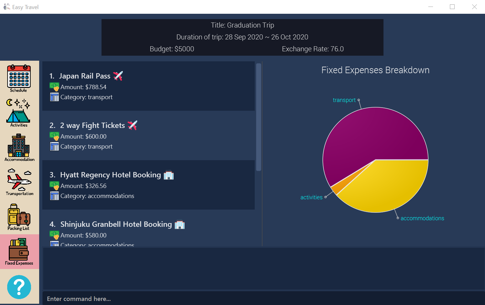

= E.T.
ifdef::env-github,env-browser[:relfileprefix: docs/]

https://ay1920s2-cs2103t-w17-3.github.io/main/[image:https://travis-ci.org/AY1920S2-CS2103T-W17-3/main.svg?branch=master[Build Status]]
https://ci.appveyor.com/project/zenatrick/main[image:https://ci.appveyor.com/api/projects/status/jrxrfp5t3d85ak03?svg=true[Build Status]]
https://coveralls.io/github/AY1920S2-CS2103T-W17-3/main?branch=master[image:https://coveralls.io/repos/github/AY1920S2-CS2103T-W17-3/main/badge.svg?branch=master[Coverage Status]]
https://app.codacy.com/gh/AY1920S2-CS2103T-W17-3/main?utm_source=github.com&utm_medium=referral&utm_content=AY1920S2-CS2103T-W17-3/main&utm_campaign=Badge_Grade_Dashboard[image:https://api.codacy.com/project/badge/Grade/e0c031d562a84e4e8a70f4463d169453[Codacy Badge]]

ifdef::env-github[]

endif::[]

ifndef::env-github[]
image::images/Ui.png[width="600"]
endif::[]

* Easy Travel (E.T.) is an all-in-one travel planner and manager, that guides the user from head to tail in planning for an overseas trip.
* E.T. is a desktop application targeted to people who want to plan for their overseas trip but find it difficult to plan.
* E.T. has a GUI but it is optimised for students who can work well with a CLI (Command Line Interface).

== Site Map

* <<UserGuide#, User Guide>>
* <<DeveloperGuide#, Developer Guide>>
* <<AboutUs#, About Us>>
* <<ContactUs#, Contact Us>>

== Acknowledgements

* Original source code, AddressBook-Level3, was created by https://se-education.org[SE-EDU initiative].
* Some parts of this sample application were inspired by the excellent http://code.makery.ch/library/javafx-8-tutorial/[Java FX tutorial] by
_Marco Jakob_.
* Libraries used: https://openjfx.io/[JavaFX], https://github.com/FasterXML/jackson[Jackson], https://github.com/junit-team/junit5[JUnit5]

== Licence : link:LICENSE[MIT]
